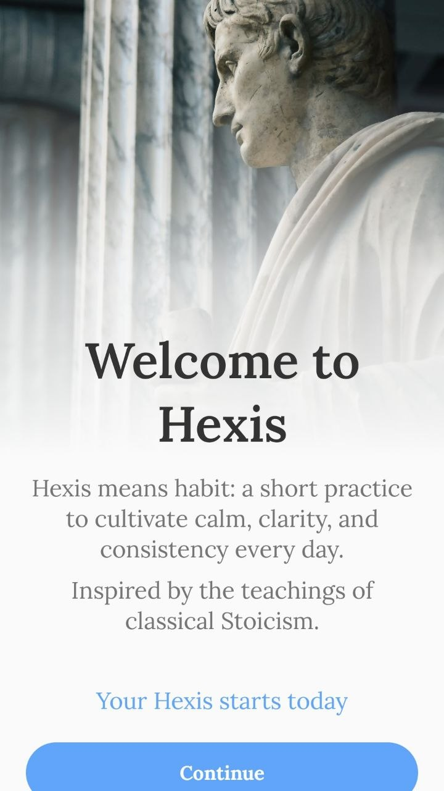
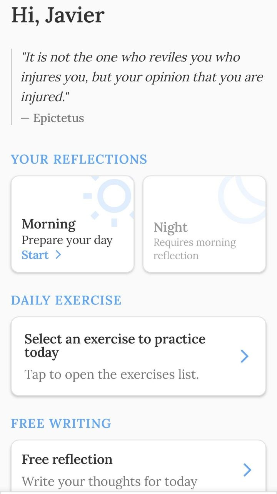

# Hexis Stoic Journal Case Study

  

  
  
  
  
  
  

Hexis Stoic Journal is a private Kotlin Multiplatform journaling app focused on daily reflection, structured writing flows, and clean architecture. 
This repository is a public technical case study. It intentionally does not include the source code.

  
  

## Tech Stack

- Kotlin Multiplatform
- Compose Multiplatform
- Clean Architecture
- MVVM
- Koin
- Coroutines and Flow
- SQLDelight

## Architecture at a Glance

The shared codebase follows a strict layered structure: Domain -> Data -> Presentation -> UI.

Each layer has a specific responsibility:

- `domain` contains models, repository interfaces, and use cases
- `data` contains repository implementations and datasources
- `presentation` contains ViewModels, state, and orchestration
- `ui` contains Compose screens and reusable components

## Key Technical Decisions

### Clean Architecture by package
Instead of splitting the project into many small modules, the app uses package-based clean architecture inside the shared codebase. This keeps the build simpler while preserving clear boundaries.

### Compose Multiplatform for shared UI
The app shares most of its UI logic across platforms, reducing duplication and keeping the product visually consistent.

### Presentation layer owns orchestration
Business decisions, validation, and flow control live in the presentation layer, while the UI remains focused on rendering.

### Multiplatform abstractions
Platform-dependent concerns such as time and dispatchers are abstracted through dedicated providers to keep common code portable.

### Typed navigation
Navigation destinations are modeled explicitly to avoid fragile string-based routes.

### SQLDelight persistence
Local persistence is handled with SQLDelight, keeping the data layer stable and aligned with the app’s offline-first approach.

## Why This Project Exists

The project was built to explore a practical journaling experience with a strong focus on privacy by default, offline-first storage, clean architecture, reusable UI across platforms, and a sustainable long-term codebase.

## Public Status

- Android is the active platform
- The app is currently in closed beta
- It is waiting for the Google Play release window to complete
- iOS is planned but not yet delivered as a dedicated app module

## Live App

The public store link will be added here once the app is published on Google Play.

## Notes

This repository is intentionally focused on documentation and technical presentation.

The goal is to make the engineering work visible without exposing the private source code.

## Documentation

- [Architecture](docs/architecture.md)
- [Technical Decisions](docs/decisions.md)
- [AI Usage](docs/ai-usage.md)

## Contact

GitHub: [JaviGarcia1995](https://github.com/JaviGarcia1995)  
Email: fcojaviergarciarodriguez.dev@gmail.com
