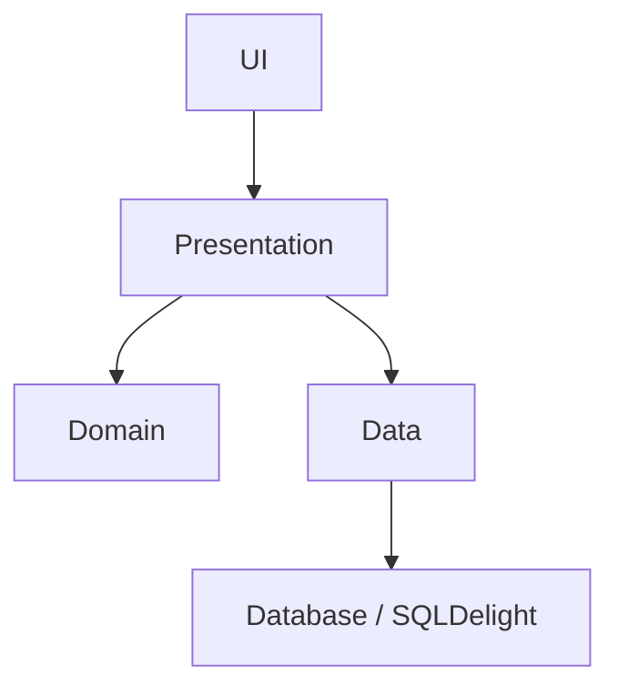
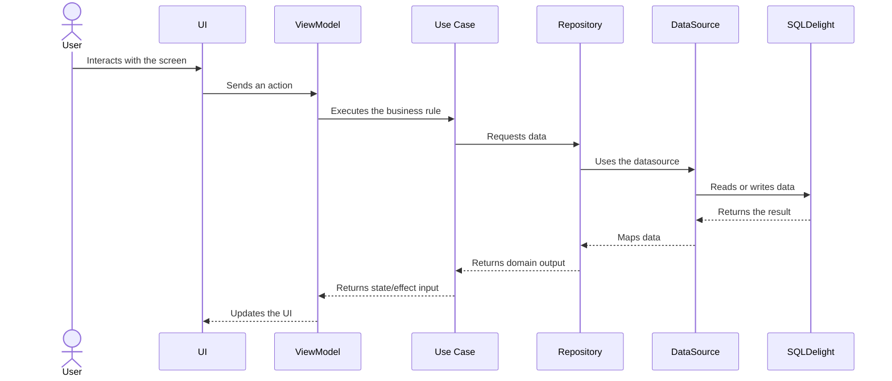

# Architecture

## Overview

Hexis Stoic Journal is built as a Kotlin Multiplatform app with a shared codebase in `shared/src/commonMain`. The main goal of the architecture is to keep the project maintainable, testable, and ready for platform sharing without turning the codebase into a collection of unrelated abstractions.

The project follows a strict layered approach:

Domain -> Data -> Presentation -> UI

Each layer has a single responsibility, and dependencies flow inward. The UI renders state, the presentation layer orchestrates behavior, the data layer provides concrete implementations, and the domain layer holds the business rules.

## Layer Diagram

## Main Structure

The shared codebase is organized around these top-level areas:

- `domain`: models, repository interfaces, use cases, filters, validators, and serializers
- `data`: repository implementations, SQLDelight-backed datasources, mappers, and seeders
- `presentation`: ViewModels, UI state, UI models, and presentation helpers
- `ui`: Compose screens, reusable components, theme, icons, and screen-specific UI
- `navigation`: shared navigation contracts, overlays, state, and transitions
- `di`: Koin modules and dependency wiring
- `database`: SQLDelight database setup and driver abstractions

## Layer Responsibilities

### Domain

The domain layer contains the core business model of the app.

It includes:
- app models such as journal entries, quotes, exercises, settings, and reminders
- repository interfaces
- use cases with a single responsibility
- domain-level filters and validators

This layer must remain free of platform-specific concerns. It defines what the app does, not how it is implemented.

### Data

The data layer provides concrete implementations for the domain contracts.

It includes:
- SQLDelight-backed repository implementations
- local datasources
- mappers between persistence models and domain models
- journal-specific SQL operations and parameter builders
- seeders for initial content

This layer is responsible for persistence and data orchestration. It bridges domain contracts with the actual storage implementation.

### Presentation

The presentation layer owns state, orchestration, and UI-facing models.

It includes:
- ViewModels
- immutable UI state
- UI models used by screens
- validation helpers
- presentation mappers
- effect handling

This layer is where business decisions are coordinated before the UI renders them. The UI should not contain validation or orchestration logic that belongs here.

### Navigation

Navigation is treated as part of the shared app architecture, not as a thin UI detail.

It includes:
- typed destinations
- navigation contracts
- overlay state
- transition definitions
- bottom navigation state and content

Navigation stays separate from screen rendering so route orchestration, overlays, and transitions remain centralized and easier to maintain.

### UI

The UI layer contains the actual Compose Multiplatform screens and components.

It includes:
- screens
- reusable components
- layout helpers
- theme
- icons
- flow-specific UI pieces for morning, night, freeform, onboarding, glossary, journal, and settings

The UI layer is render-only. It receives state and callbacks, then displays the interface without owning business rules.

### DI and Database

These layers provide the technical wiring needed by the shared codebase.

They include:
- Koin modules and dependency setup
- SQLDelight database configuration
- driver abstractions
- repository wiring

These are infrastructure concerns that connect the rest of the architecture without leaking implementation details into the domain layer.

## Data Flow

A typical feature flow follows this path:

1. The UI receives user input.
2. The UI delegates the event to a ViewModel.
3. The ViewModel validates input or decides the next action.
4. The ViewModel calls a domain use case.
5. The use case talks to a repository interface.
6. The data layer resolves the concrete repository implementation.
7. The repository uses a datasource or SQLDelight-backed operation.
8. The result returns to the ViewModel as state or an effect.
9. The UI re-renders from the updated state.

This structure keeps the UI simple and makes feature behavior easier to test and reason about.

## Feature Organization

The app is split by feature inside the presentation and UI layers.

Current flows include:
- morning journaling
- night journaling
- freeform journaling
- glossary
- onboarding
- settings
- journal history and summaries

Each flow has its own presentation logic and UI composition, while shared components are reused only when they genuinely help more than one flow.

## Boundary Rules

These are the main architectural constraints followed in the project:

- `ui` must not depend directly on `domain`
- business logic and orchestration belong in `presentation`
- platform-specific concerns must be wrapped behind abstractions
- domain models should stay free of framework details
- repository interfaces live in `domain`, implementations live in `data`
- shared code in `commonMain` must remain multiplatform

## Why This Architecture

This structure was chosen to keep the project practical rather than over-engineered.

The main benefits are:
- clear separation of responsibilities
- shared business logic across platforms
- easier testing
- simpler maintenance than a multi-module setup
- flexibility to evolve the app without breaking layer boundaries

## Summary

The architecture is intentionally strict where it matters and lightweight where it should be.

It keeps the shared codebase multiplatform, the UI focused on rendering, the presentation layer responsible for orchestration, and the data layer responsible for persistence. That balance is what makes the project sustainable as a long-term codebase.
